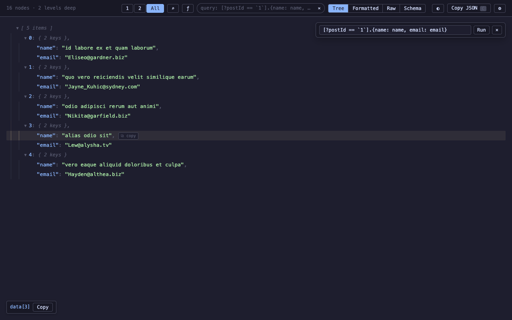
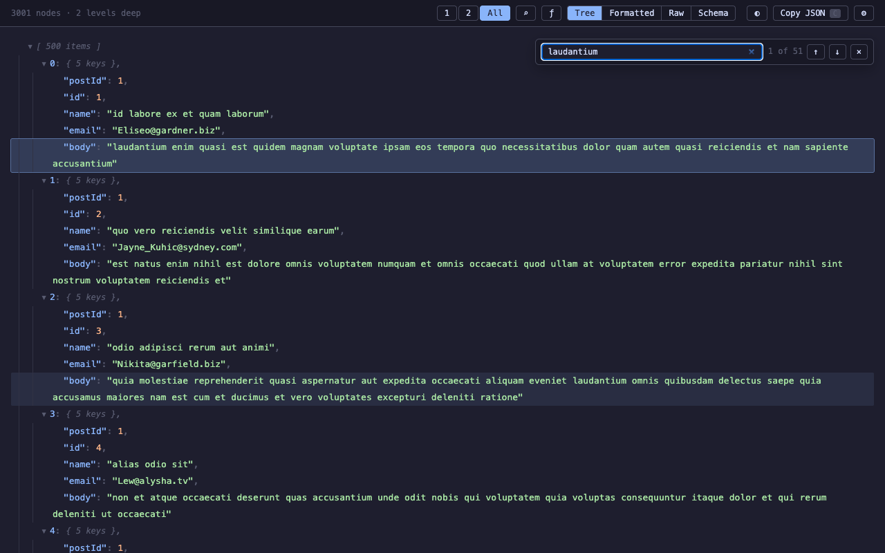
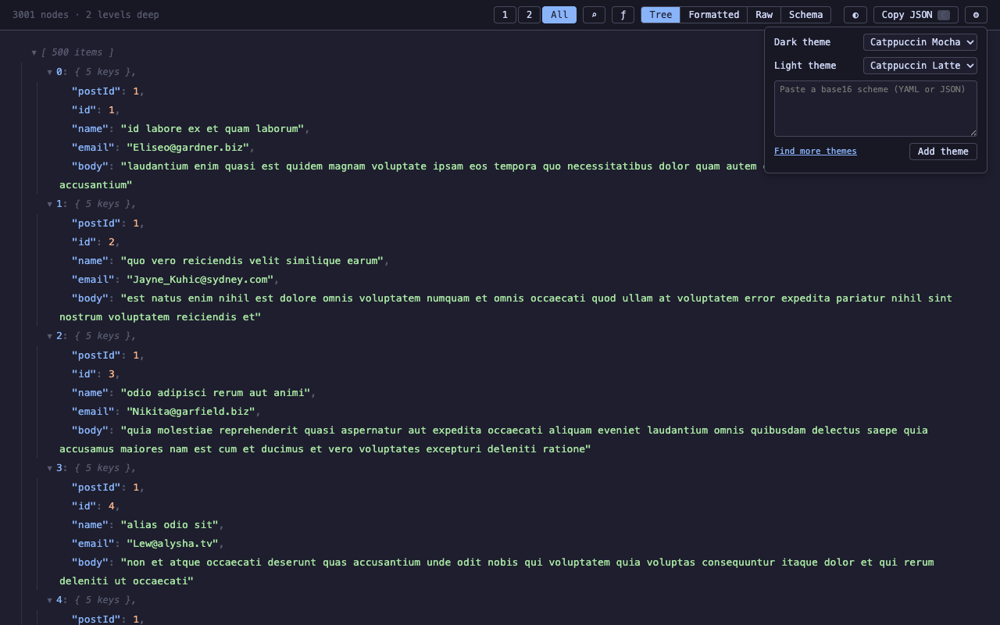
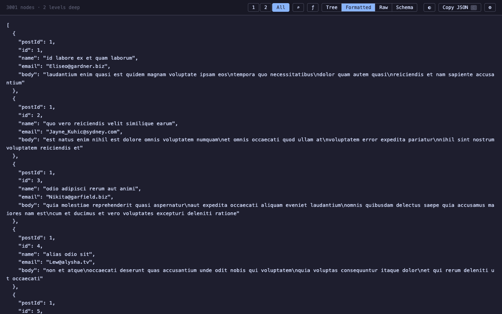
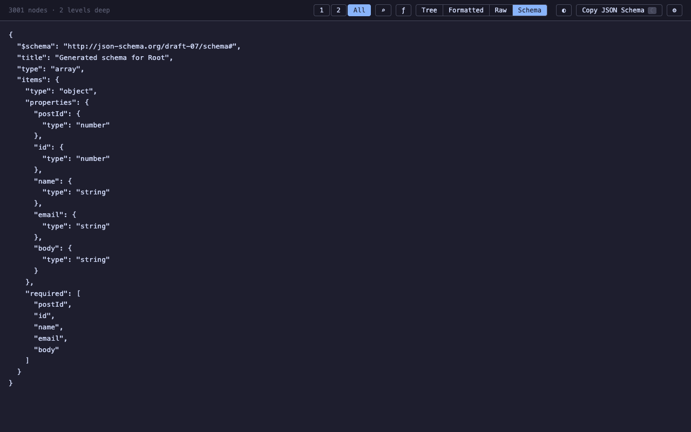

# JSON Bonsai

Prune, shape, and navigate giant JSON trees — a browser extension JSON viewer built to stay smooth on 100k+ node payloads.


**Install:** [Chrome Web Store](https://chromewebstore.google.com/detail/json-bonsai/dpcomlfdaamelgcgnalkfomdfpmioeml) · [Firefox Add-ons](https://addons.mozilla.org/en-US/firefox/addon/json-bonsai/)

## Screenshots

<table>
  <tr>
    <td width="50%"><br><sub>Query (JMESPath)</sub></td>
    <td width="50%"><br><sub>Search</sub></td>
  </tr>
  <tr>
    <td width="50%"><br><sub>Theming</sub></td>
    <td width="50%"><br><sub>Formatted</sub></td>
  </tr>
  <tr>
    <td width="50%"><br><sub>Schema</sub></td>
    <td width="50%"></td>
  </tr>
</table>

## Features

### Views

- Five view modes: Tree, Table, Formatted, Raw, and Schema (inferred JSON Schema, draft-07)
- Virtualized tree rendering — smooth scrolling and interaction on 100k+ node payloads
- Table view for arrays of objects — sortable columns, virtualized rows, works on query results too
- Collapsible/expandable tree view with level controls — press `1`–`8` to set depth, `0` to expand all
- Syntax highlighting for keys, strings, numbers, booleans, and null; URLs become clickable links
- Indent guide lines with hover highlighting

### Query, search, and copy

- JMESPath query bar (`Q`) — filter and reshape the JSON; the result renders as a fully interactive tree
- Query relative to any node — "Query from here" seeds a node's path; append `| expr` to query inside that subtree, with autocomplete resolving keys against the scoped node
- Content search in a web worker with match navigation (`⌘F` / `⌘G`, `Enter` / `Shift+Enter`); in table view, search filters the rows instead
- Hover any property to see its full JSON path — click to pin, then copy
- Per-node actions: copy any subtree's value, expand/collapse all children
- Copy JSON to clipboard (`C`) — copies what the active view shows (raw, pretty, schema, or query result)
- Optional console access — opt in (Settings ⚙, off by default) to expose the payload as `window.data`

### Fidelity

- Lossless big numbers — 64-bit IDs and high-precision decimals display and copy exactly as sent, where `JSON.parse` would silently corrupt them

### Personalization and platform

- base16 theming — 13 bundled schemes plus your own custom themes, with auto/dark/light mode switching
- Per-site memory — the view mode, tree depth, and query/search history you use are remembered per origin and restored on your next visit; query/search history can be disabled in Settings
- Cross-platform builds (Windows/macOS/Linux) and a single package that works in both Chrome and Firefox

## Installation

Install directly from the [Chrome Web Store](https://chromewebstore.google.com/detail/json-bonsai/dpcomlfdaamelgcgnalkfomdfpmioeml) or [Firefox Add-ons](https://addons.mozilla.org/en-US/firefox/addon/json-bonsai/).

Prebuilt `.zip` packages are attached to each [GitHub Release](https://github.com/pedrosousa13/JSON-Bonsai/releases). To run from source, build it first — the `dist/` folder is not committed:

```bash
npm install
npm run build
```

### Chrome

1. Open Chrome and navigate to `chrome://extensions`
2. Enable **Developer mode** (toggle in the top right)
3. Click **Load unpacked**
4. Select the **`dist`** folder inside this project

### Firefox

1. Open Firefox and navigate to `about:debugging#/runtime/this-firefox`
2. Click **Load Temporary Add-on...**
3. Select the `manifest.json` file inside **`dist`**

#### Disable Firefox's Native JSON Viewer

Firefox has a built-in JSON viewer that can prevent this add-on from taking over JSON pages. Disable it first:

1. Open a new tab and go to `about:config`
2. Accept the warning prompt if shown
3. Search for `devtools.jsonview.enabled`
4. Set it to `false`
5. Reload any JSON page

## Usage

Navigate to any URL that returns JSON (e.g. `https://jsonplaceholder.typicode.com/users`). The extension automatically detects JSON responses and replaces the page with an interactive viewer.

- **Level buttons** (1, 2, 3... All) — collapse/expand the tree to a specific depth
- **View picker** (Tree / Table / Formatted / Raw / Schema) — switch between interactive tree, sortable table (enabled when the root is an array of objects), pretty-printed JSON, raw JSON, and an inferred JSON Schema
- **Query** (ƒ or `Q`) — run a [JMESPath](https://jmespath.org) expression, e.g. `items[?price > \`10\`].name`; the result replaces the tree, ✕ on the chip restores the document
- **Search** (⌕ or `⌘F`) — find keys, values, and paths; `Enter` / `Shift+Enter` step through matches. In table view, search filters the rows and shows a row count instead
- **Theme toggle** — cycle the theme mode between auto (◐), dark (☾), and light (☀)
- **Copy JSON** (`C`) — copy what the active view shows
- **Click any line** — pins the JSON path in the toolbar, click Copy to copy it
- **Keyboard** — `1`–`8` set tree depth, `0` expands all, `C` copies, `Q` queries, `⌘F` searches
- **Console** — enable **Settings (⚙) → "Expose payload as `window.data`"** (off by default) to make the parsed JSON available as `window.data`
- **Settings** (⚙) — pick your dark/light schemes and add custom themes (see [Theming](#theming))

> **Privacy note:** the `window.data` convenience is **off by default**. When you turn it on in Settings, the parsed payload is exposed to the page's main-world JavaScript (including any other extensions running there) on the page's own origin. Once read, JSON Bonsai removes the in-page copy from the DOM. Leave the toggle off if you view authenticated API responses on origins that also run scripts.

## Theming

JSON Bonsai uses [base16](https://github.com/tinted-theming/home) color schemes for syntax highlighting and the UI.

### Mode

The toolbar theme button cycles the theme **mode**:

- **◐ Auto** — follows your operating system's light/dark setting
- **☾ Dark** — always dark
- **☀ Light** — always light

You pair one dark scheme and one light scheme in the settings menu (⚙). In auto mode, the viewer switches between that pair as your OS flips between light and dark.

### Bundled schemes

13 schemes ship with the extension:

- **Dark:** Catppuccin Mocha (default), Dracula, Nord, Gruvbox Dark, Solarized Dark, OneDark, Tokyo Night Dark, GitHub Dark, Monokai
- **Light:** Catppuccin Latte (default), Gruvbox Light, Solarized Light, GitHub Light

### Custom themes

You can add any base16 scheme of your own:

1. Open the settings menu (⚙) and choose **Add theme**
2. Paste a base16 scheme as published in the [tinted-theming/schemes](https://github.com/tinted-theming/schemes) repo (YAML) — JSON is also accepted
3. The theme is added to your scheme lists, ready to pair with a mode

Invalid pastes show an inline error. Custom themes can be deleted from the settings menu; deleting one that's currently in use reverts to the default scheme.

There are ~290 more ready-made schemes at [tinted-theming/schemes](https://github.com/tinted-theming/schemes) (also linked from the settings menu).

## Development

```bash
npm run dev       # watch mode — rebuilds on file changes
npm run build     # production build
npm run typecheck # TypeScript, no emit
npm test          # unit tests (vitest)
npm run test:e2e  # browser tests (Playwright — loads the built extension into Chromium)
npm run zip       # build and create json-bonsai.zip
npm run package   # build and create per-store zips (Chrome + Firefox)
```

`test:e2e` needs a build first and a one-time `npx playwright install chromium`. CI runs typecheck, unit tests, build, and the E2E suite on every PR.

Releases are manual: run `npm run package` to build the Chrome and Firefox zip files, then attach them to a GitHub Release and submit them to the browser stores.

After making changes, reload the extension in your browser.

## Credits

JSON Bonsai started as a fork of [JSON Alexander](https://github.com/wesbos/JSON-Alexander) by [Wes Bos](https://github.com/wesbos) and remains MIT licensed — see [LICENSE](LICENSE).

It has since been largely rewritten. Of the four original source files only the ~15-line page bootstrap is unchanged; the viewer and content scripts were rebuilt and roughly tripled in size. Virtualized rendering, the Table and Schema views, the JMESPath query bar, web-worker search, lossless big numbers, base16 theming, per-site memory, the build scripts, and the test suite are all new. Thanks to Wes Bos for the original viewer this grew out of.
